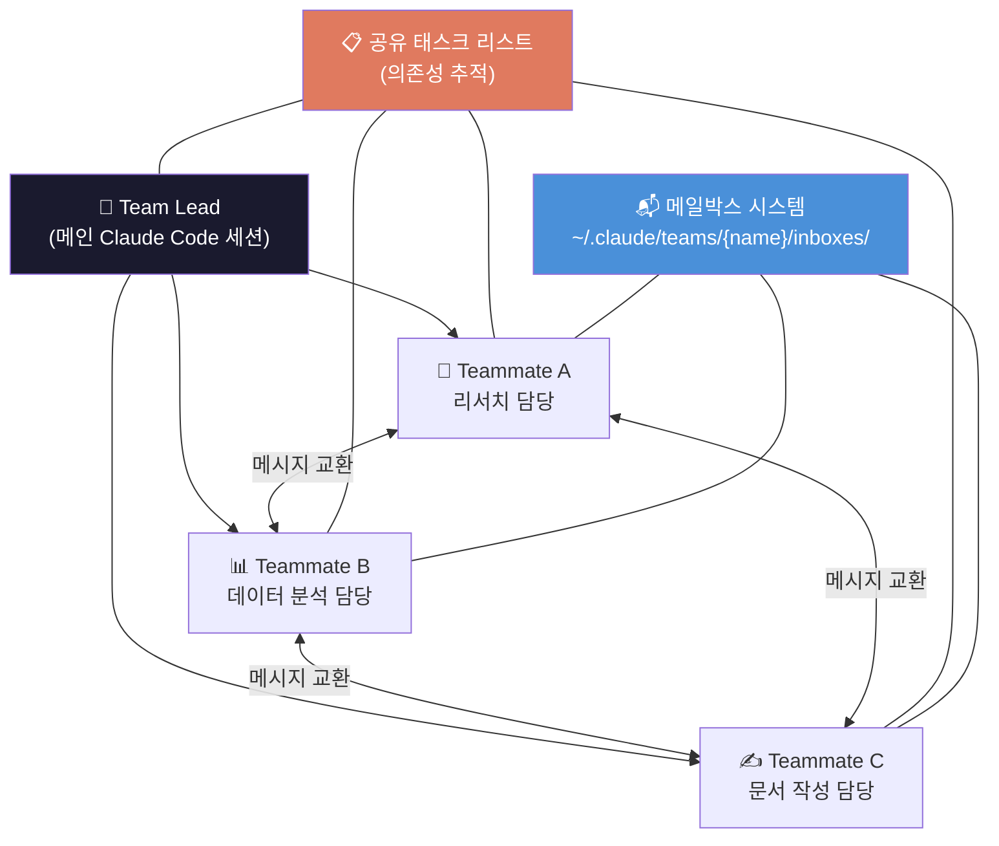

# 에이전트 팀: 멀티 에이전트 협업 설정

## 개요

2.4에서 커스텀 서브에이전트를 만들었다면, **에이전트 팀(Agent Teams)**은 그 다음 단계입니다.
서브에이전트가 "호출하면 보고하는 부하 직원"이라면, 에이전트 팀은 **서로 소통하며 자율적으로 일하는 팀원들**입니다.

2026년 2월 Claude Code에 실험적으로 추가된 기능으로, 하나의 **팀 리드** 세션이 여러 **팀메이트** 세션을 생성하고, 각자 독립적인 컨텍스트 윈도우에서 병렬로 작업합니다.

**서브에이전트 vs 에이전트 팀:**

| 구분 | 서브에이전트 (2.4) | 에이전트 팀 (2.5) |
| --- | --- | --- |
| **커뮤니케이션** | 호출자에게만 보고 | 팀원끼리 직접 소통 |
| **독립성** | 호출자 의존 | 자율적 태스크 수행 |
| **병렬성** | 순차/병렬 호출 | 완전 병렬 (별도 세션) |
| **적합한 상황** | 빠른 리뷰, 단일 관점 검토 | 복잡한 프로젝트, 다각도 협업 |
| **설정 복잡도** | 낮음 (마크다운 파일) | 중간 (환경변수 + 설정) |

---

## 1. 에이전트 팀 활성화

### 1.1 설정 방법

에이전트 팀은 실험적 기능이므로 별도 활성화가 필요합니다.

**방법 1: settings.json (권장 — 영구 적용)**

```json
// ~/.claude/settings.json
{
  "CLAUDE_CODE_EXPERIMENTAL_AGENT_TEAMS": "1"
}
```

**방법 2: 환경 변수 (일회성)**

```
Terminal:
$ export CLAUDE_CODE_EXPERIMENTAL_AGENT_TEAMS=1
$ claude
```

> ⚠️ 환경 변수는 세션 종료 시 사라집니다. 반복 사용하려면 settings.json을 권장합니다.

### 1.2 활성화 확인

```
Terminal 입력:
$ claude

> 에이전트 팀 기능을 사용할 수 있는지 확인해줘

Claude Code 응답:
✅ Agent Teams 기능이 활성화되어 있습니다.
사용 가능한 명령:
- spawnTeammate: 새 팀원 생성
- sendMessage: 팀원에게 메시지 전송
- taskList: 공유 태스크 관리
```

---

## 2. 핵심 아키텍처

### 2.1 팀 구성 요소



**팀 리드 (Team Lead):**
- 메인 Claude Code 세션
- 팀원 생성, 태스크 할당, 결과 통합
- **Delegate 모드**에서 직접 코드/파일 수정 불가 → 조율에만 집중

**팀메이트 (Teammates):**
- 각각 별도 Claude Code 인스턴스 (독립 컨텍스트 윈도우)
- 파일 읽기/쓰기, 명령 실행, 다른 팀원에게 메시지 전송 가능
- 태스크 완료 시 다음 가용 태스크를 자동으로 클레임

**공유 태스크 리스트:**
- 의존성 추적 가능 (Task B는 Task A 완료 후 시작)
- 파일 락 기반으로 동시 클레임 방지

**메일박스 시스템:**
- `~/.claude/teams/{team-name}/inboxes/{name}.json`에 메시지 저장
- 다른 에이전트가 모니터링하여 수신 즉시 처리

### 2.2 Delegate 모드

팀 리드가 태스크를 직접 처리하지 않고 **팀원에게 위임**하도록 강제하는 모드입니다.

```
Terminal 입력:
$ claude

# Delegate 모드 활성화:
Shift+Tab → "Delegate" 선택

# Delegate 모드에서 팀 리드가 사용 가능한 도구:
✅ spawnTeammate (팀원 생성)
✅ sendMessage (메시지 전송)
✅ taskList (태스크 관리)
✅ shutdownTeammate (팀원 종료)

❌ Edit (파일 수정)
❌ Write (파일 생성)
❌ Bash (명령 실행)
```

**PM 관점에서의 비유**: 팀 리드 = PM 자신. Delegate 모드는 "PM이 직접 코딩하지 않고 팀원에게 방향을 제시하는 것"과 같습니다.

---

## 3. PM 실전 워크스루

### 3.1 경쟁사 분석 병렬 수행

**시나리오**: 3개 경쟁사의 가격 정책, 기능 비교, 사용자 리뷰를 동시에 분석

```
Terminal 입력:
$ claude

> 에이전트 팀을 구성해서 경쟁사 3곳을 병렬 분석해줘.
>
> 팀 구성:
> - researcher-a: CompetitorX 분석 (가격, 기능, 리뷰)
> - researcher-b: CompetitorY 분석 (가격, 기능, 리뷰)
> - researcher-c: CompetitorZ 분석 (가격, 기능, 리뷰)
>
> 각 팀원은 분석 결과를 research/competitors/ 폴더에 저장.
> 3명 모두 완료되면, 통합 비교표를 competitive-landscape.md로 만들어줘.

Claude Code (Team Lead) 응답:

🏢 에이전트 팀 생성 중...

✅ Spawned: researcher-a → CompetitorX 분석 시작
✅ Spawned: researcher-b → CompetitorY 분석 시작
✅ Spawned: researcher-c → CompetitorZ 분석 시작

📋 공유 태스크 리스트:
1. [researcher-a] CompetitorX 분석 → 진행 중
2. [researcher-b] CompetitorY 분석 → 진행 중
3. [researcher-c] CompetitorZ 분석 → 진행 중
4. [lead] 통합 비교표 생성 → ⏳ 1~3 대기 중

--- 5분 후 ---

✅ researcher-a: CompetitorX 분석 완료
   → research/competitors/competitor-x.md 저장됨

✅ researcher-b: CompetitorY 분석 완료
   → research/competitors/competitor-y.md 저장됨

✅ researcher-c: CompetitorZ 분석 완료
   → research/competitors/competitor-z.md 저장됨

📊 모든 팀원 완료. 통합 비교표 생성 중...

✅ research/competitors/competitive-landscape.md 저장됨
```

### 3.2 스프린트 리뷰 병렬 준비

**시나리오**: 스프린트 리뷰를 위해 여러 소스에서 동시에 데이터 수집

```
Terminal 입력:
> 스프린트 리뷰 자료를 팀으로 준비해줘.
>
> 팀 구성:
> - data-collector: Linear에서 스프린트 데이터 수집 + 통계 정리
> - slack-summarizer: Slack #product 채널의 이번 주 핵심 논의 요약
> - doc-writer: 수집된 데이터를 기반으로 리뷰 발표 자료 작성
>
> data-collector와 slack-summarizer가 먼저 완료되면,
> doc-writer가 그 결과를 합쳐서 sprint-review.md 생성.

Claude Code (Team Lead) 응답:

📋 태스크 의존성 설정:
1. [data-collector] Linear 데이터 수집 → 진행 중
2. [slack-summarizer] Slack 요약 → 진행 중
3. [doc-writer] 리뷰 자료 작성 → ⏳ 1, 2 대기 중
```

### 3.3 PRD 멀티 관점 리뷰

2.4의 서브에이전트와 에이전트 팀을 결합한 고급 시나리오:

```
Terminal 입력:
> PRD v2를 팀 리뷰 방식으로 검토해줘.
>
> 팀원:
> - eng-reviewer: 기술 실현 가능성, API 설계, 성능 관점
> - design-reviewer: UX 일관성, 접근성, 사용자 플로우 관점
> - biz-reviewer: 비즈니스 임팩트, 수익 모델, 경쟁 포지셔닝 관점
>
> 각 리뷰어끼리 의견이 충돌하면 서로 메시지를 교환해서 합의점을 찾아줘.
> 최종적으로 통합 리뷰 결과를 정리해줘.

Claude Code (Team Lead) 응답:

✅ eng-reviewer: "캐시 레이어 추가 필요. 현재 설계는 P95 2초 초과 위험"
✅ design-reviewer: "캐시 추가 시 실시간 데이터 반영이 안 되면 UX 손상"
✅ biz-reviewer: "실시간 반영은 Enterprise 고객의 핵심 요구사항"

💬 팀원 간 논의 발생:
eng-reviewer → design-reviewer:
  "Stale-while-revalidate 패턴 적용하면 캐시 + 실시간 모두 해결 가능"

design-reviewer → eng-reviewer:
  "좋은 제안. 다만 로딩 스피너 대신 이전 데이터를 보여주는 UI 필요"

📋 합의된 리뷰 결과:
1. ✅ Stale-while-revalidate 캐시 패턴 적용 (eng + design 합의)
2. ⚠️ Enterprise SLA 명시 필요 (biz 요청)
3. 🔄 데이터 갱신 주기 UI 표시 추가 (design 제안)
```

---

## 4. 설정 파일 구조

### 4.1 팀 설정

```
~/.claude/
├── settings.json              # 에이전트 팀 활성화
├── teams/
│   └── {team-name}/
│       ├── config.json        # 팀 설정
│       └── inboxes/           # 메일박스
│           ├── lead.json
│           ├── researcher-a.json
│           └── researcher-b.json
└── tasks/
    └── {team-name}/           # 공유 태스크
```

### 4.2 설정 계층 (Settings Hierarchy)

Claude Code의 설정은 5단계 스코프로 평가됩니다 (높은 우선순위 → 낮은 우선순위):

```
1. 세션 내 설정 (가장 높음)
2. 프로젝트 설정 (.claude/settings.json)
3. 팀 설정 (~/.claude/teams/{name}/config.json)
4. 사용자 전역 설정 (~/.claude/settings.json)
5. 시스템 기본값 (가장 낮음)
```

높은 스코프가 낮은 스코프를 오버라이드하되, 낮은 레벨에만 정의된 키는 그대로 유효합니다.

---

## 5. PM 판단 포인트

### ❓ "서브에이전트(2.4)와 에이전트 팀(2.5), 언제 뭘 써야 하나?"

```
서브에이전트가 적합한 경우:
- 빠른 단일 관점 리뷰 (5분 이내)
- 호출자에게만 결과 보고하면 되는 경우
- 설정 없이 즉시 사용하고 싶은 경우
- 예: "이 PRD를 엔지니어 관점에서 한번 봐줘"

에이전트 팀이 적합한 경우:
- 여러 관점이 서로 충돌/합의해야 하는 경우
- 대규모 병렬 작업 (3개+ 동시 진행)
- 태스크 간 의존성이 있는 경우
- 예: "3개 경쟁사를 동시에 분석하고, 통합 비교표 만들어줘"
```

### ❓ "파일 충돌은 어떻게 방지하나?"

```
가장 큰 함정: 여러 팀원이 같은 파일을 동시에 수정하는 것

방지 전략:
1. 디렉토리/파일 소유권 분리
   → researcher-a는 competitor-x.md만, researcher-b는 competitor-y.md만
2. 태스크 의존성 활용
   → 공유 파일은 단일 작성자만 접근하도록 순서 지정
3. 통합 작업은 마지막에 팀 리드가 수행
   → 개별 결과물 → 팀 리드가 합치기
```

### ❓ "팀원에게 충분한 컨텍스트를 어떻게 전달하나?"

```
주의: 팀원은 팀 리드의 대화 이력을 상속받지 않습니다.

✅ 좋은 예:
> researcher-a를 생성해줘.
> 역할: CompetitorX 분석가
> 분석 항목: 가격 정책 (플랜별 비교), 핵심 기능 (우리 제품 대비),
>            사용자 리뷰 (긍정/부정 Top 5)
> 참고 파일: research/competitors/template.md
> 출력: research/competitors/competitor-x.md

❌ 나쁜 예:
> researcher-a를 생성해서 경쟁사 분석해줘.
  (어떤 경쟁사? 어떤 항목? 어디에 저장?)
```

---

## 6. 제한사항 & 주의점

```
현재 제한 (2026년 2월 기준):

1. 실험적 기능 — 향후 변경 가능
2. 세션 재개 불가 — 팀원이 중간에 끊기면 처음부터 다시
3. 세션 당 팀 1개 — 중첩 팀 불가
4. 팀원 수 제한 — 너무 많으면 조율 오버헤드 증가 (3~5명 권장)
5. 비용 — 각 팀원이 별도 API 사용량 소비
```

---

## 7. 실습 과제

### Level 1 (J): 첫 에이전트 팀 구성
settings.json에 에이전트 팀을 활성화하고, 2명의 팀원으로 간단한 병렬 작업(예: 2개 파일 동시 분석)을 실행하세요.

### Level 2 (P): 태스크 의존성 활용
3명의 팀원이 각각 데이터를 수집하고, 모두 완료된 후 통합 보고서를 자동 생성하는 워크플로를 구축하세요.

### Level 3 (L): 정기 팀 리뷰 자동화
매주 스프린트 리뷰 전에 에이전트 팀이 자동으로 데이터 수집 → 분석 → 발표 자료 생성을 수행하도록 스킬(3.4)과 결합하세요.

---

**이전 문서**: [2.4-custom-subagents.md](./2.4-custom-subagents.md) — 커스텀 서브에이전트
**다음 문서**: [3.1-mcp-integration.md](./3.1-mcp-integration.md) — MCP 연동


---

> **© 2026 김생근 (Sanguine Kim)** | AI Agent Lead & AI Tutor
> 본 자료는 [CC BY-NC 4.0](https://creativecommons.org/licenses/by-nc/4.0/) 라이선스를 따릅니다.
> 교육·학술 목적 자유 이용 가능 | 상업적 이용 시 별도 라이선스 필요
> 강의·기업 교육·상업적 활용 문의: kimsanguine@gmail.com
