# CLAUDE.md 심화: PM 워크스페이스 설계

## 왜 CLAUDE.md가 PM의 가장 중요한 파일인가

기본편(1.3-project-memory.md)에서 메모리 계층 구조를 배웠다면, 이제 실전으로 들어간다.

CLAUDE.md는 단순한 메모 파일이 아니다. **PM의 모든 행동 규칙을 코드화하는 매니페스토다.**

매번 대화할 때마다 "우리 팀의 OKR이 뭐고, 경쟁사 분석은 어떻게 하고, PRD는 어떤 구조로..." 이런 설명을 반복하는가? 그 모든 것을 CLAUDE.md에 쓰면, Claude가 자동으로 읽고 당신의 관례대로 움직인다.

**Before**: 매 대화마다 컨텍스트를 다시 설명 (5-10분)
**After**: CLAUDE.md가 자동으로 컨텍스트 주입 (0분)

---

## 실전 PM CLAUDE.md 전체 예시

```markdown
# CLAUDE.md — AI PM 워크스페이스

## 나는 누구인가

- **이름**: [이름], **직함**: Product Manager at [회사명]
- **경력**: SaaS / 모바일 / AI 제품 중 선택
- **현재 목표**: Q1에 신규 프로덕트 런칭 / 기존 제품 스케일 / 시장 진입
- **Claude Code의 역할**: PRD 작성, 경쟁사 분석, 사용자 조사 정리, 데이터 시각화

## 폴더 구조

```mermaid
graph TD
    ROOT["🏠 ai-pm-workspace/"] --> PRD["📋 prd/<br/><i>PRD & 기획 문서</i>"]
    ROOT --> STATUS["📊 status/<br/><i>주간 상태 보고서</i>"]
    ROOT --> RESEARCH["🔍 research/<br/><i>리서치 자료</i>"]
    ROOT --> CONTENT["✍️ content/<br/><i>교육 + 마케팅 콘텐츠</i>"]
    ROOT --> PROTO["🎨 prototypes/<br/><i>피그마 / 프로토타입 링크</i>"]
    ROOT --> TMPL["📄 templates/<br/><i>반복 사용 템플릿</i>"]
    ROOT --> LLM["🧠 llm-context/<br/><i>AI가 참고할 컨텍스트</i>"]
    ROOT --> CLAUDE["⚙️ .claude/<br/><i>Claude 설정</i>"]

    PRD --> PA["project-a/<br/>prd-v1.md, user-stories.md, metrics.md"]
    PRD --> PB["project-b/"]

    STATUS --> SW08["2026-w08-status.md"]
    STATUS --> SW07["2026-w07-status.md"]

    RESEARCH --> COMP["competitors/<br/><i>경쟁사 분석 (5축)</i>"]
    RESEARCH --> MKT["market/<br/><i>시장 조사 & 트렌드</i>"]
    RESEARCH --> DIG["digest/<br/><i>일일 뉴스 다이제스트</i>"]

    CONTENT --> BLOG["blog/"]
    CONTENT --> NL["newsletter/"]

    TMPL --> T1["prd-template.md"]
    TMPL --> T2["user-story-template.md"]
    TMPL --> T3["status-report-template.md"]

    LLM --> FW["frameworks/<br/><i>AARRR, OMTM 등</i>"]
    LLM --> BR["brand/<br/><i>브랜드 가이드 & 톤</i>"]
    LLM --> TS["tech-stack.md"]
    LLM --> TEAM["team-structure.md"]

    CLAUDE --> RULES["rules.md<br/><i>행동 규칙</i>"]
    CLAUDE --> CMD["commands/<br/><i>Custom Slash Commands</i>"]

    style ROOT fill:#1a1a2e,color:#fff
    style CLAUDE fill:#4a90d9,color:#fff
    style LLM fill:#7b68ee,color:#fff
    style PRD fill:#2d6a4f,color:#fff
    style RESEARCH fill:#e07a5f,color:#fff
```



> **💡 Tip**: 이 Mermaid 다이어그램은 Notion, GitHub, Confluence에서 바로 렌더링됩니다.
> 텍스트 기반이므로 버전 관리(Git diff)도 가능합니다.
## 태스크 형식: YAML Front Matter

모든 태스크 문서는 이렇게 시작한다:

```yaml
---
type: prd | user-story | research | content | analysis
due: 2026-02-28
tags: [q1-planning, user-engagement, mobile]
status: draft | in-progress | review | done
omtm: engagement  # One Metric That Matters
priority: p0 | p1 | p2
---

# 제목

## 왜 이 문제가 중요한가

[배경 및 가설]

## 경쟁사는 어떻게 하는가

[5축 분석]
```

이렇게 하면 Claude가 자동으로 프로젝트의 우선순위, deadline, 관심 지표를 이해한다.

---

## 문서 작성 원칙: 5가지

### 원칙 1: 항상 한국어로 작성
- 팀과의 소통이 한국어
- 문화적 맥락과 시장 이해가 담길 때 최고의 기획이 나온다
- Claude가 한국 시장 뉘앙스를 더 잘 캐치함

### 원칙 2: 질문과 답변 형태 선호
"이 기능이 가치가 있는가?" → "우리 사용자가 얼마나 자주 이 문제를 겪는가? → "경쟁사는 어떻게 해결했는가?"

기획은 **답을 정하는 것이 아니라, 올바른 질문을 찾는 것**이다.

### 원칙 3: 경쟁사/유저 문제 기반 가설 포함

❌ 나쁜 예:
```
## 제안
사용자가 더 쉽게 공유할 수 있도록 "공유" 버튼을 추가한다.
```

✅ 좋은 예:
```
## 가설
노션 사용자의 47%가 "공유 권한 설정이 복잡하다"고 답했다. (사용자 조사)
경쟁사 슬랙은 "1클릭 공유"로 이를 해결했고, 공유 증가율 3배.

## 검증 방법
- A/B 테스트: 기존 UI vs 새 UI
- 목표: 월간 공유 수 +30%
```

### 원칙 4: 결론보다 과정/탐구 과정 중시

PRD를 숨겨진 보물 지도처럼 쓴다. "이 기능이 최고"라고 단언하는 대신, "우리가 이렇게 생각하는 이유는..."를 보여준다.

### 원칙 5: OMTM(One Metric That Matters) 프레임워크 적용

매 프로젝트마다 **단 하나의 성공 지표**를 정한다:
- 사용자 활성화 → Daily Active Users (DAU)
- 수익화 → Monthly Recurring Revenue (MRR)
- 리텐션 → 30-Day Retention Rate

---

## AI Evals 기준: Claude의 결과물을 평가하기

Claude가 만든 PRD, 분석 문서의 품질을 어떻게 판단할 것인가? CLAUDE.md에 명시한다:

```yaml
# 품질 기준 (Evaluation Criteria)

Accuracy:
  - 경쟁사 정보는 최신인가? (6개월 이내)
  - 숫자는 검증되었는가?
  - 출처가 명시되어 있는가?

Completeness:
  - PRD에 User Story가 3개 이상 있는가?
  - Success Metrics이 정의되었는가?
  - Rollout Plan이 있는가?

Tone:
  - 한국 시장에 적합한가?
  - 팀의 문화를 반영하는가?

Format:
  - 마크다운 구조가 일관적인가?
  - 최대 2000자/섹션?
```

---

## 경쟁사 분석: 5축 프레임워크

경쟁사를 분석할 때마다 이 5개 축으로 한다:

```markdown
## [경쟁사명] 분석

### 1. Product (제품)
- 핵심 기능은?
- 우리보다 나은 점은? / 부족한 점은?
- UI/UX 디자인의 특징?

### 2. Pricing (가격)
- 요금제 구조?
- 우리보다 비싼가? 싼가?
- 포지셔닝: 프리미엄? 대중? 엔터프라이즈?

### 3. Positioning (포지셔닝)
- 타겟 고객은?
- 핵심 메시지는?
- 우리와 다른 점?

### 4. Performance (성과)
- 사용자 수? (공개된 정보)
- 성장률?
- 시장 점유율?

### 5. People (사람)
- 창업자/리더 배경?
- 팀 규모?
- 문화 / 가치관?
```

이 5축으로 정리하면, "우리가 이기려면 어디를 집중해야 할까"가 명확해진다.

---

## CLAUDE.md 발전시키기: 3단계 로드맵

### Stage 1: 기본 (첫 주)
- "나는 누구인가" 섹션 작성
- 폴더 구조 정의
- 기본 작성 원칙 3개 선정

**시간**: 2-3시간
**효과**: Claude와의 대화가 이전보다 40% 정확해짐

### Stage 2: 성숙 (2-3주)
- YAML Front Matter 도입
- AI Evals 기준 정의
- 경쟁사 분석 템플릿 추가
- 주요 프레임워크 (AARRR, Lean Canvas, User Journey) 문서화

**시간**: 8-10시간
**효과**: Claude가 생성하는 PRD의 품질이 외부 컨설턴트 수준으로 상향

### Stage 3: 고도화 (1개월+)
- Slash Commands로 "경쟁사 분석 시작", "주간 상태 리포트 생성" 등 자동화
- 매주 "CLAUDE.md 피드백 루프": Claude가 부족한 컨텍스트를 알려주고, 당신이 추가
- 팀원들과 CLAUDE.md 공유 → 일관된 기획 방식 정착

**시간**: 지속적 (주 2-3시간)
**효과**: 팀 전체가 AI를 활용한 기획 방식으로 전환

---

## CLAUDE.md vs Cursor Rules vs System Prompt

이 세 가지의 차이를 이해해야 한다:

| 구분 | CLAUDE.md | Cursor Rules | System Prompt |
| --- | --- | --- | --- |
| **저장 위치** | 로컬 파일 (git) | Cursor 설정 | Claude 백엔드 |
| **버전 관리** | ✓ Git으로 추적 가능 | ✗ 버전 관리 어려움 | ✗ 불가능 |
| **팀 공유** | ✓ 쉬움 | ✗ 개인 설정 | ✗ 불가능 |
| **계층 구조** | ✓ 폴더별 다른 규칙 | ~ 제한적 | ✗ 없음 |
| **AI 자동 읽음** | ✓ 프롬프트 에드온 | ✓ IDE에서 | ✗ 수동 입력 필요 |
| **유지보수** | ✓ 좋음 | ~ 중간 | ✗ 어려움 |

**결론**: PM으로서 팀과 협업한다면, **CLAUDE.md가 최적이다.**

---

## PM 역할 확장 포인트

CLAUDE.md를 도입하면 PM의 역할이 어떻게 변하는가?

### Before (CLAUDE.md 없음)
```
PM: "Claude, 우리 회사는 SaaS고, 사용자는 기업이고, 시장은 미국이고...
    우리 경쟁사는 Slack, Notion, Airtable이고...
    우리는 협업 도구를 만드는데, 모바일 쪽이 약하고...
    이번 달 목표는 모바일 신규 기능 추가인데, PRD를 좀 만들어줄래?"

시간: 10분 (설명) + 15분 (결과물 검토) = 25분
```

### After (CLAUDE.md 적용)
```
PM: "@claude /generate-prd --project mobile-new-feature"

Claude: (CLAUDE.md를 자동으로 읽고)
"SaaS PM이 모바일 신규 기능 PRD를 요청하네요.
Slack/Notion/Airtable과의 경쟁 맥락에서,
30-Day Retention을 OMTM으로 해서 PRD 생성합니다."

시간: 1분 (명령) + 10분 (결과물 검토) = 11분
```

**핵심 질문**: 당신은 어떤 판단을 자동화하고, 어떤 판단은 매번 직접 할 것인가?

---

## ⚠️ 주의: 흔한 실수들

### 실수 1: 너무 많은 규칙
```
❌ 나쁜 예: CLAUDE.md가 50개 섹션, 5000자

Claude가 혼란스러워한다. "어떤 규칙을 우선순위로 따를까?"
```

**해결책**:
- 핵심 규칙만 3-5개
- 나머지는 폴더별로 분산
- 매달 한 번 리뷰하면서 불필요한 규칙 제거

### 실수 2: 너무 적은 구체성
```
❌ 나쁜 예:
"경쟁사를 분석하는데, 좋은 포맷으로 해줘"

Claude: (모호함) → 매번 다른 포맷으로 출력
```

**해결책**:
- 5축 프레임워크처럼, 명확한 체크리스트 제시
- YAML Front Matter 구조 명시
- 좋은 예시 1-2개 포함

### 실수 3: 업데이트 안 함
```
❌ 나쁜 예:
CLAUDE.md 작성 → 2주 방치 →
경쟁사 정보가 2개월 전 것 → Claude가 오래된 정보 기반으로 분석
```

**해결책**:
- 달력에 "CLAUDE.md 검토" 일정 추가 (주 1회, 10분)
- 매 프로젝트 시작할 때 "CLAUDE.md 최신화" 체크리스트
- "Last Updated: 2026-02-22" 표시

---

## 실습 과제

### Level 1: 기본 (30분)
당신의 CLAUDE.md 작성 시작:
1. "나는 누구인가" 작성 (경력, 현재 목표, Claude Code의 역할)
2. 폴더 구조 5개 이상 정의
3. 작성 원칙 3개 선정

### Level 2: 심화 (1주일)
1. Level 1 완성
2. 본인 프로젝트에 맞는 CLAUDE.md 완성 (400-500자)
3. 이 CLAUDE.md를 사용해서 Claude와 대화하기 (최소 5회)
4. **3회 이상 업데이트**: 부족한 컨텍스트를 발견할 때마다 CLAUDE.md에 추가

**체크리스트**:
- [ ] CLAUDE.md가 프로젝트 루트 디렉토리에 있는가?
- [ ] 최소 3개 섹션이 있는가? (나는 누구인가, 폴더 구조, 작성 원칙)
- [ ] YAML Front Matter 예시가 1개 이상 있는가?
- [ ] Claude와의 5번 대화 기록이 있는가?

### Level 3: 도전 (2주)
CLAUDE.md 기반으로 팀 내 "기획 가이드라인" 만들기:
- 모든 PM이 따를 작성 원칙
- 공유 가능한 경쟁사 분석 템플릿
- 팀 내 OMTM 정의

---

## 결론: CLAUDE.md는 당신의 AI PM 조수 설명서

CLAUDE.md가 없으면, Claude Code는 똑똑한 조수지만 당신의 일하는 방식을 모른다.
CLAUDE.md가 있으면, Claude Code는 당신의 방식을 자동으로 따르는 **확장된 당신**이 된다.

특히 PM은 매일 다양한 태스크를 한다:
- 월요일: PRD 작성
- 화요일: 경쟁사 분석
- 수요일: 사용자 피드백 정리
- 목요일: 주간 상태 리포트

**CLAUDE.md 하나면, 모든 태스크에서 일관된 품질과 속도를 유지할 수 있다.**

당신의 CLAUDE.md를 오늘 시작하라.


---

> **© 2026 김생근 (Sanguine Kim)** | AI Agent Lead & AI Tutor
> 본 자료는 [CC BY-NC 4.0](https://creativecommons.org/licenses/by-nc/4.0/) 라이선스를 따릅니다.
> 교육·학술 목적 자유 이용 가능 | 상업적 이용 시 별도 라이선스 필요
> 강의·기업 교육·상업적 활용 문의: kimsanguine@gmail.com
