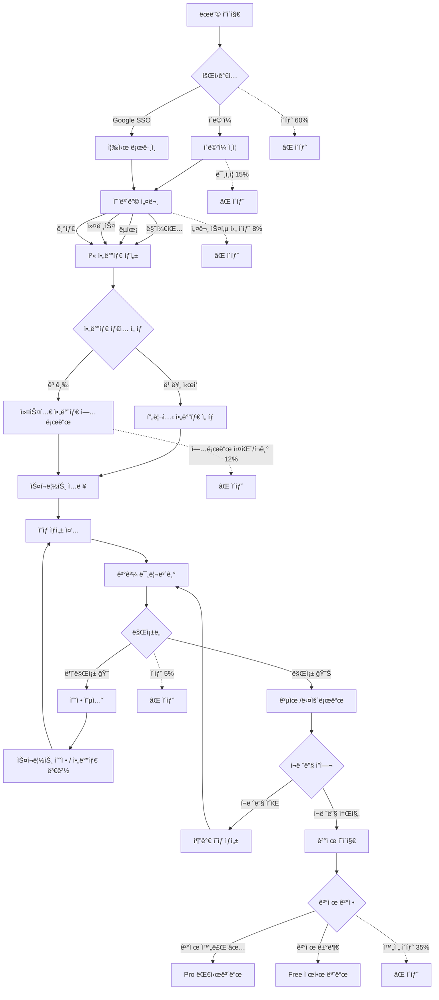
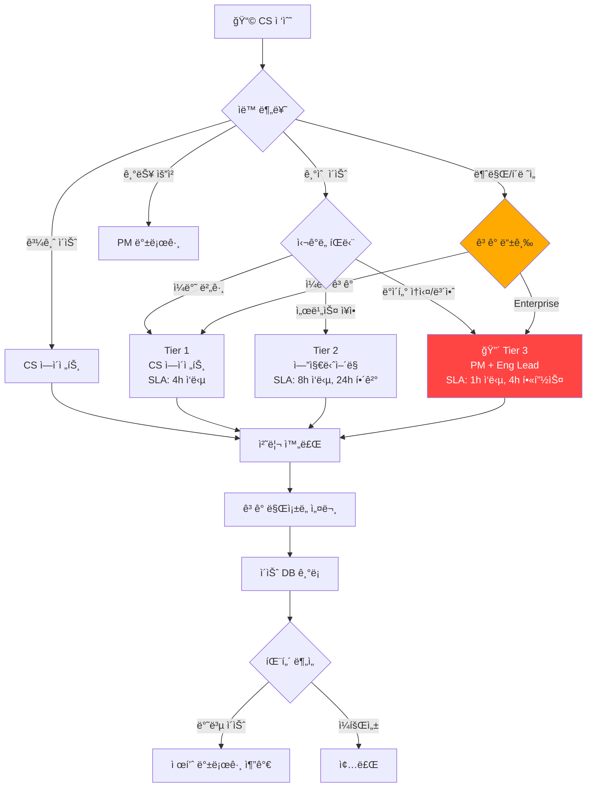

# 유즈케ì´ìŠ¤: 제품 프로세스 플로우차트 문서화

> **PM 역량**: 프로세스 설계 / 시스템 사고 / 커뮤니케ì´ì…˜
> **ë‚œì´ë„**: J → P
> **관련 문서**: [5.1-definition-write-prd.md](./5.1-definition-write-prd.md), [6.1-delivery-vibe-coding.md](./6.1-delivery-vibe-coding.md)

---

## 왜 PMì—게 필요한가?

PMì€ ëŠì„ì—†ì´ í”„ë¡œì„¸ìŠ¤ë¥¼ 설계하고 문서화합니다: 사용ì 온보딩 플로우, ê²°ì œ 프로세스, ì—스컬레ì´ì…˜ 절차, 릴리즈 파ì´í”„ë¼ì¸. 하지만 ë³µì¡í•œ 프로세스를 ì‹œê°í™”하는 ê²ƒì€ ì‹œê°„ì´ ë§ì´ 걸리고, Lucidchart나 Miroì—ì„œ 박스를 하나하나 그리는 ì‘ì—…ì€ PMì˜ í•µì‹¬ 업무가 아닙니다.

Claude Code는 **í…스트 설명 → Mermaid 다ì´ì–´ê·¸ë¨ → ì‹œê°í™” 가능한 코드**를 즉시 ìƒì„±í•©ë‹ˆë‹¤. PMì€ "프로세스를 설명"하면 ë˜ê³ , ì‹œê°í™”는 Claudeê°€ 처리합니다.

---

## ìƒí™©

ë‹¹ì‹ ì€ AI Avatar ì„œë¹„ìŠ¤ì˜ PMì…니다. ë‹¤ìŒ 3가지 프로세스를 문서화해야 합니다:

1. **사용ì 온보딩 플로우**: ê°€ì… â†’ 첫 아바타 ìƒì„± → ê²°ì œ 전환까지
2. **ê³ ê° ì—스컬레ì´ì…˜ 프로세스**: CS 접수 → 분류 → 해결까지
3. **릴리즈 프로세스**: ê¸°íš â†’ 개발 → QA → ë°°í¬ê¹Œì§€

ê°ê° 다른 ì´í•´ê´€ê³„ì(ë””ìì´ë„ˆ, CS팀, 엔지니어ë§)ì—게 공유해야 합니다.

---

## 기존 ë°©ì‹ vs Claude ë°©ì‹

```
기존 (ë°˜ì¼~1ì¼, 프로세스당):
1. 프로세스 정리 (í™”ì´íŠ¸ë³´ë“œ/노트)
2. Lucidchart/Miroì—ì„œ 박스 그리기
3. 분기ì , ì¡°ê±´ 추가
4. 색ìƒ, ìŠ¤íƒ€ì¼ ì •ë¦¬
5. ì´í•´ê´€ê³„ì 리뷰 → 수정 반복

Claude (15~30분, 프로세스당):
1. í…스트로 프로세스 설명 → Mermaid 코드 ìƒì„± (5분)
2. PM 리뷰 → 수정 요청 (5분)
3. 최종 Mermaid를 Notion/Confluenceì— ë¶™ì—¬ë„£ê¸° (5분)
```

---

## 워í¬ìŠ¤ë£¨

### Step 1: 온보딩 플로우 ìƒì„±

```
Terminal ì…ë ¥:
> AI Avatar ì„œë¹„ìŠ¤ì˜ ì‚¬ìš©ì 온보딩 플로우차트를 Mermaidë¡œ 만들어줘.

  플로우:
  1. ëœë”© í˜ì´ì§€ ë„ì°©
  2. 회ì›ê°€ì… (ì´ë©”ì¼ or Google SSO)
  3. 온보딩 설문 (ìš©ë„ ì„ íƒ: 마케팅/êµìœ¡/커머스/기타)
  4. 첫 아바타 ìƒì„± ê°€ì´ë“œ
     - 프리셋 아바타 ì„ íƒ (빠른 ì‹œì‘)
     - 커스텀 아바타 업로드 (고급)
  5. 첫 ì˜ìƒ ìƒì„±
  6. 결과 미리보기
  7. 분기ì : 만족하면 → 공유/다운로드 → ê²°ì œ 유ë„
              불만족하면 → 수정 옵션 → ì¬ìƒì„±
  8. 무료 í¬ë ˆë”§ 소진 ì‹œ → ê²°ì œ í˜ì´ì§€
  9. 결제 완료 → 대시보드

  ê° ë‹¨ê³„ì—ì„œ ì´íƒˆ 가능한 지ì ë„ 표시해줘.
  그리고 ê° ë‹¨ê³„ì˜ ì˜ˆìƒ ì „í™˜ìœ¨ë„ ì½”ë©˜íŠ¸ë¡œ 넣어줘.

Claude Code ì‘답:



ì „ì²´ í¼ë„ 전환율 요약:

| 단계 | 전환율 | 업계 ë²¤ì¹˜ë§ˆí¬ | ìƒíƒœ |
| --- | --- | --- | --- |
| ëœë”© → ê°€ì… | 40% | 25~35% | ✅ 양호 |
| ê°€ì… â†’ 첫 ìƒì„± | 72% | 60~70% | ✅ 양호 |
| 첫 ìƒì„± → ê²°ì œ í˜ì´ì§€ | 45% | 30~40% | ✅ 양호 |
| ê²°ì œ í˜ì´ì§€ → ê²°ì œ | 65% | 50~60% | ✅ 양호 |
| **ì „ì²´ (ëœë”© → 유료)** | **8.2%** | **3\~7%** | ✅ ìƒìœ„ |

âš ï¸ [PM í™•ì¸ í•„ìš”]
위 ì „í™˜ìœ¨ì€ ê°€ì •ì…니다. 실제 í¼ë„ ë°ì´í„°ë¡œ êµì²´í•˜ì„¸ìš”.
Amplitude/Mixpanelì—ì„œ 실제 수치를 가져오면 ë” ì •í™•í•©ë‹ˆë‹¤.
```
### Step 2: ì—스컬레ì´ì…˜ 프로세스
```
Terminal ì…ë ¥:
> ê³ ê° ì—스컬레ì´ì…˜ í”„ë¡œì„¸ìŠ¤ë„ ë§Œë“¤ì–´ì¤˜.

  플로우:
  1. CS 접수 (채팅/ì´ë©”ì¼/ì „í™”)
  2. ìë™ ë¶„ë¥˜ (ë´‡): 기술 ì´ìŠˆ / 과금 ì´ìŠˆ / 기능 요청 / 불만
  3. 티어 분류:
    - Tier 1 (ì¼ë°˜): CS ì—ì´ì „트가 즉시 처리
    - Tier 2 (기술): ì—”ì§€ë‹ˆì–´ë§ íŒ€ ì—스컬레ì´ì…˜
    - Tier 3 (긴급): PM + ì—”ì§€ë‹ˆì–´ë§ ë¦¬ë“œ í•©ë™ ëŒ€ì‘
  1. SLA:
    - Tier 1: 4시간 ì´ë‚´ ì‘답
    - Tier 2: 8시간 ì´ë‚´ ì‘답, 24시간 ì´ë‚´ í•´ê²°
    - Tier 3: 1시간 ì´ë‚´ ì‘답, 4시간 ì´ë‚´ 핫픽스
  1. í•´ê²° 후: ê³ ê° ë§Œì¡±ë„ ì„¤ë¬¸ → ì´ìŠˆ DB 기ë¡

  Tier 3 경로를 빨간색으로 강조해줘.

Claude Code ì‘답:


```
### Step 3: 프로세스 ë¹„êµ ë° ê°œì„ ì  ë„출
```
Terminal ì…ë ¥:
> í˜„ì¬ ì˜¨ë³´ë”© 플로우ì—ì„œ 개선할 수 ìˆëŠ” 지ì ì„ 분ì„해줘.
  특íˆ:
  1. ì´íƒˆë¥ ì´ ê°€ì¥ ë†’ì€ ë‹¨ê³„
  2. 단계를 ì¤„ì¼ ìˆ˜ ìˆëŠ” ê³³
  3. A/B 테스트 우선순위 제안

  í˜„ì¬ í”Œë¡œìš°ì™€ 개선안 플로우를 나ë€íˆ 비êµí•˜ëŠ” 형태로.

Claude Code ì‘답:

## 개선 분ì„

### 최대 ì´íƒˆ ì§€ì  (Impact × Volume 기준)

| 순위 | 단계 | ì´íƒˆë¥  | ì˜ˆìƒ ì˜í–¥ | 개선안 |
| --- | --- | --- | --- | --- |
| 1 | ëœë”©â†’ê°€ì… | 60% | ê°€ì¥ í° ë³¼ë¥¨ ì†ì‹¤ | SSO ì›í´ë¦­ ê°•í™”, ê°€ì… ì „ ë°ëª¨ |
| 2 | ê²°ì œ í˜ì´ì§€â†’ê²°ì œ | 35% | 매출 ì§ì ‘ ì˜í–¥ | 가격 앵커ë§, 소셜 프루프 |
| 3 | 커스텀 업로드 실패 | 12% | 고가치 유저 ì´íƒˆ | 업로드 ê°€ì´ë“œ + 실패 ì‹œ 프리셋 제안 |

### A/B 테스트 우선순위

1. 🥇 "ê°€ì… ì „ ë°ëª¨ ì²´í—˜" — ê°€ì… ì—†ì´ í”„ë¦¬ì…‹ 아바타 ì²´í—˜ 후 ì €ì¥ ì‹œ ê°€ì…
2. 🥈 "ê²°ì œ í˜ì´ì§€ 소셜 프루프" — 유사 업종 ê³ ê° ì‚¬ë¡€ + ROI 수치 표시
3. 🥉 "업로드 실패 → 프리셋 í´ë°±" — 업로드 실패 ì‹œ ìë™ í”„ë¦¬ì…‹ 제안
```
---

## PM íŒë‹¨ í¬ì¸íŠ¸

### â“ "Mermaid 다ì´ì–´ê·¸ë¨ìœ¼ë¡œ 충분한가? Figmaê°€ ë” ì¢‹ì§€ 않나?"
```
Mermaidì˜ ì¥ì :
- í…스트 기반 → 버전 관리 가능 (Git)
- ìˆ˜ì •ì´ ë¹ ë¦„ (박스 ë“œë˜ê·¸ 대신 í…스트 수정)
- Notion, GitHub, Confluenceì—ì„œ 바로 ë Œë”ë§
- "프로세스 변경 ì´ë ¥"ì„ diffë¡œ ì¶”ì  ê°€ëŠ¥

Figma/Lucidchartê°€ ë” ë‚˜ì€ ê²½ìš°:
- 외부 프레젠테ì´ì…˜ìš© (ì‹œê°ì  완성ë„)
- 비개발ì ì´í•´ê´€ê³„ì 대ìƒ
- ë³µì¡í•œ ì¸í„°ë™í‹°ë¸Œ 프로토타ì…

PM íŒë‹¨ 기준:
→ "내부 문서화 + 빠른 반복" = Mermaid
→ "외부 발표 + ì‹œê°ì  ì„팩트" = Figma
→ 둘 다 필요하면: Mermaidë¡œ 초안 → Figmaë¡œ 마ê°
```
### â“ "전환율 수치를 Claudeê°€ 추정한 ê±´ë°, ë¯¿ì–´ë„ ë˜ë‚˜?"
```
절대 그대로 사용하면 안 ë©ë‹ˆë‹¤.

Claudeê°€ 제공하는 전환율ì€:
- 업계 ë²¤ì¹˜ë§ˆí¬ ê¸°ë°˜ 추정
- "ì´ ì •ë„ ë²”ìœ„ê°€ ì¼ë°˜ì ì´ë‹¤"는 참고값

PMì´ í•´ì•¼ 하는 것:
1. Amplitude/Mixpanelì—ì„œ 실제 í¼ë„ ë°ì´í„° 추출
2. Claude 추정 vs 실제 수치 비êµ
3. 실제 수치가 ë²¤ì¹˜ë§ˆí¬ ëŒ€ë¹„ 낮으면 → 개선 기회
4. 실제 수치가 ë²¤ì¹˜ë§ˆí¬ ëŒ€ë¹„ 높으면 → 유지/ê°•í™”

→ Claudeì˜ í”Œë¡œìš°ì°¨íŠ¸ë¥¼ "ë°ì´í„°ë¥¼ 채울 ë¹ˆì¹¸ì´ ìˆëŠ” 프레ì„"으로
  활용하세요. 프레ì„ì€ Claude, 숫ì는 PM.
```
---

## 고급: 프로세스 ìë™ ë¬¸ì„œí™”
```
Terminal ì…ë ¥:
> 우리 íŒ€ì˜ ì£¼ìš” 프로세스 5개를 Mermaidë¡œ 문서화해서
  /docs/processes/ í´ë”ì— ì €ì¥í•´ì¤˜.

  1. onboarding-flow.md — 사용ì 온보딩
  2. escalation-process.md — ì—스컬레ì´ì…˜
  3. release-pipeline.md — 릴리즈 파ì´í”„ë¼ì¸
  4. feature-request-flow.md — 기능 요청 처리
  5. incident-response.md — ì¥ì•  대ì‘

  ê° ë¬¸ì„œì— í¬í•¨:
  - Mermaid 다ì´ì–´ê·¸ë¨
  - ê° ë‹¨ê³„ 설명 (담당ì, SLA, ì…출력)
  - 알려진 병목/개선 기회
  - 마지막 ì—…ë°ì´íŠ¸ ì¼ì
```
---

## 실습 과제

### Level 1 (J): ë‹¨ì¼ í”„ë¡œì„¸ìŠ¤ ì‹œê°í™”
ìì‹ ì´ ë‹´ë‹¹í•˜ëŠ” ì œí’ˆì˜ í•µì‹¬ 프로세스 1개를 Mermaid 플로우차트로 만드세요. Notionì´ë‚˜ GitHubì— ì‚½ì…하여 íŒ€ì— ê³µìœ í•˜ì„¸ìš”.

### Level 2 (P): í¼ë„ + ë°ì´í„° 분ì„
온보딩 ë˜ëŠ” ê²°ì œ 플로우를 ì‘성하고, 실제 전환율 ë°ì´í„°ë¥¼ 매핑하세요. 최대 ì´íƒˆ 지ì ì— 대한 A/B 테스트 계íšì„ 세우세요.

### Level 3 (L): 프로세스 ë¼ì´ë¸ŒëŸ¬ë¦¬
íŒ€ì˜ ì£¼ìš” 프로세스 5ê°œ ì´ìƒì„ 문서화하는 ë¼ì´ë¸ŒëŸ¬ë¦¬ë¥¼ 구축하세요. 분기별 ìë™ ë¦¬ë·°(프로세스 변경사항 ê°ì§€)를 설정하세요.

---

**ë‹¤ìŒ ìœ ì¦ˆì¼€ì´ìŠ¤**: [A.10-usecase-content-adaptation.md](./A.10-usecase-content-adaptation.md) — í¬ë¡œìŠ¤ 플ë«í¼ 콘í…츠 ì ì‘


---

> **© 2026 ê¹€ìƒê·¼ (Sanguine Kim)** | AI Agent Lead & AI Tutor
> 본 ì료는 [CC BY-NC 4.0](https://creativecommons.org/licenses/by-nc/4.0/) ë¼ì´ì„ ìŠ¤ë¥¼ 따릅니다.
> êµìœ¡Â·í•™ìˆ  ëª©ì  ì유 ì´ìš© 가능 | ìƒì—…ì  ì´ìš© ì‹œ ë³„ë„ ë¼ì´ì„ ìŠ¤ í•„ìš”
> ê°•ì˜Â·ê¸°ì—… êµìœ¡Â·ìƒì—…ì  í™œìš© 문ì˜: kimsanguine@gmail.com
```