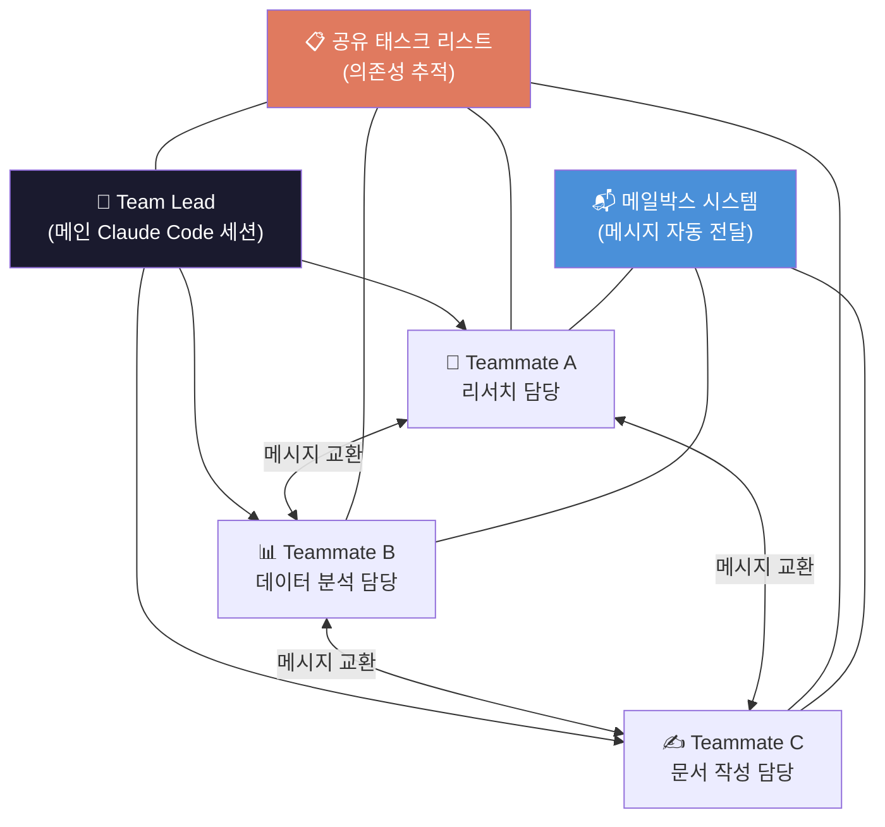

# 에이전트 팀: 멀티 에이전트 협업 설정

## 개요

2.4에서 커스텀 서브에이전트를 만들었다면, **에이전트 팀(Agent Teams)**은 그 다음 단계입니다.
서브에이전트가 "호출하면 보고하는 부하 직원"이라면, 에이전트 팀은 **서로 소통하며 자율적으로 일하는 팀원들**입니다.

하나의 **팀 리드** 세션이 여러 **팀메이트** 세션을 생성하고, 각자 독립적인 컨텍스트 윈도우에서 병렬로 작업하며, 공유 태스크 리스트와 메일박스로 서로 소통합니다.

> **현행 상태 (2026-06-02 기준, 공식 문서 확인)**: "에이전트 팀(Agent teams)"은 여전히 **실험적(experimental)이며 기본 비활성화**입니다 (Claude Code v2.1.32 이상 필요). 다만 그동안 **별도의 정식 경로**가 하나 더 생겼습니다 — **Dynamic Workflows(동적 워크플로)** 입니다. 이 둘은 서로를 대체한 게 아니라 **공존**하며, 용도가 다릅니다.
>
> - **에이전트 팀**: 소수(3–5명 권장)의 팀원이 서로 *대화*하며 합의·반박해야 할 때. 리드가 턴 단위로 조율.
> - **Dynamic Workflows**: 한 대화로 조율하기엔 너무 큰 작업(수십~수백 에이전트, 대규모 감사·마이그레이션·교차검증 리서치). Claude가 JavaScript 오케스트레이션 스크립트를 작성하고 런타임이 백그라운드로 실행 (research preview, v2.1.154 이상). 이 경로는 이 챕터 끝의 7절에서 소개합니다.
>
> **4.7 + PM 운영 현실**: 4.7 은 기본적으로 적은 수의 subagent 만 띄우고, 단일 세션의 적응적 추론을 더 신뢰합니다. PM 운영 측면에서는 **사용자 측 병렬 세션**(3–6개) 이 새로운 정상치 — 같은 사람이 git worktree 로 동시에 여러 작업을 돌리는 패턴입니다. Stop 훅(2.7) 알림으로 어느 세션이 끝났는지 즉시 압니다.

**서브에이전트 vs 에이전트 팀:**

| 구분 | 서브에이전트 (2.4) | 에이전트 팀 (2.5) |
| --- | --- | --- |
| **커뮤니케이션** | 호출자에게만 보고 | 팀원끼리 직접 소통 |
| **독립성** | 호출자 의존 | 자율적 태스크 수행 |
| **병렬성** | 순차/병렬 호출 | 완전 병렬 (별도 세션) |
| **적합한 상황** | 빠른 리뷰, 단일 관점 검토 | 복잡한 프로젝트, 다각도 협업 |
| **설정 복잡도** | 낮음 (마크다운 파일) | 중간 (환경변수 + 설정) |

---

## 1. 에이전트 팀 활성화

### 1.1 설정 방법

에이전트 팀은 실험적 기능이라 기본 비활성화 상태이므로 별도 활성화가 필요합니다.
(Claude Code v2.1.32 이상 필요 — `claude --version` 으로 확인)

**방법 1: settings.json (권장 — 영구 적용)**

공식 문서 기준, 이 키는 최상위가 아니라 `"env"` 블록 안에 넣어야 합니다.

```json
// ~/.claude/settings.json
{
  "env": {
    "CLAUDE_CODE_EXPERIMENTAL_AGENT_TEAMS": "1"
  }
}
```

**방법 2: 환경 변수 (일회성)**

```
Terminal:
$ export CLAUDE_CODE_EXPERIMENTAL_AGENT_TEAMS=1
$ claude
```

> ⚠️ 환경 변수는 세션 종료 시 사라집니다. 반복 사용하려면 settings.json을 권장합니다.

### 1.2 사용 방법: 자연어로 팀 요청

활성화 후에는 별도 명령어를 외울 필요가 없습니다. **자연어로 팀과 작업을 설명**하면
Claude가 팀을 만들고, 팀원을 생성하고, 작업을 조율합니다.

```
Terminal 입력:
$ claude

> 에이전트 팀을 만들어서 이 문제를 세 가지 관점으로 탐색해줘:
> 한 명은 UX, 한 명은 기술 아키텍처, 한 명은 악마의 변호인 역할로.

Claude Code 응답:
🏢 에이전트 팀을 구성합니다.
- 팀 리드(현재 세션)가 공유 태스크 리스트를 만들고 팀원 3명을 생성합니다.
- 각 팀원은 독립 세션에서 작업하며, 메일박스로 서로 메시지를 주고받습니다.
```

> **참고**: 팀원끼리의 직접 메시징은 내부적으로 `SendMessage` 도구로 처리됩니다.
> PM이 이 이름을 직접 칠 일은 없고, 자연어로 "리서처에게 ~라고 전해줘"처럼 지시하면 됩니다.

---

## 2. 핵심 아키텍처

### 2.1 팀 구성 요소



**팀 리드 (Team Lead):**

- 메인 Claude Code 세션 (팀을 만든 세션이 끝까지 리드)
- 팀원 생성, 태스크 할당, 결과 통합
- 직접 코딩하기보다 팀원에게 위임하고 조율에 집중 (2.2 참조)

**팀메이트 (Teammates):**

- 각각 별도 Claude Code 인스턴스 (독립 컨텍스트 윈도우)
- 파일 읽기/쓰기, 명령 실행, 다른 팀원에게 메시지 전송 가능
- 태스크 완료 시 다음 가용 태스크를 자동으로 클레임

**공유 태스크 리스트:**

- 의존성 추적 가능 (Task B는 Task A 완료 후 시작)
- 파일 락 기반으로 동시 클레임 방지

**메일박스 시스템:**

- 팀원이 보낸 메시지가 수신자에게 자동 전달됩니다 (리드가 따로 폴링할 필요 없음).
- 팀원이 작업을 끝내고 멈추면 자동으로 리드에게 알립니다.

### 2.2 리드의 역할: 위임과 플랜 승인

팀 리드는 PM 자신입니다. 리드는 직접 코딩하기보다 **팀원에게 작업을 나눠 위임하고**,
결과를 종합하는 데 집중합니다. 자연어로 지시하면 됩니다.

```
Terminal 입력:
$ claude

> 이 모듈들을 병렬로 리팩터링할 팀원 4명을 만들어줘.
> 단, 팀원들이 작업을 끝낼 때까지 네가 직접 손대지 말고 기다려.
```

리드가 팀원을 기다리지 않고 스스로 작업을 시작하려 하면, 위처럼 명시적으로
**"팀원이 끝낼 때까지 기다려"**라고 지시하면 됩니다.

**플랜 승인(plan approval) — 위험한 작업에 권장:**

복잡하거나 되돌리기 어려운 작업은, 팀원이 먼저 **계획을 세워 리드의 승인을 받게**
강제할 수 있습니다. 팀원은 읽기 전용 plan 모드에서 계획만 세우고, 리드가 승인해야
실제 변경을 시작합니다.

```
> 인증 모듈을 리팩터링할 아키텍트 팀원을 만들어줘.
> 변경 전에 반드시 플랜 승인을 받도록 해줘.
> 테스트 커버리지가 포함된 계획만 승인해.
```

**PM 관점에서의 비유**: 리드 = PM, 플랜 승인 = "착수 전에 접근 방식을 먼저 보고받고
OK 사인을 주는 것". PM이 직접 코딩하지 않고 방향을 제시하는 Human-in-the-Loop의 한 형태입니다.

---

## 3. PM 실전 워크스루

### 3.1 경쟁사 분석 병렬 수행

**시나리오**: 3개 경쟁사의 가격 정책, 기능 비교, 사용자 리뷰를 동시에 분석

```
Terminal 입력:
$ claude

> 에이전트 팀을 구성해서 경쟁사 3곳을 병렬 분석해줘.
>
> 팀 구성:
> - researcher-a: CompetitorX 분석 (가격, 기능, 리뷰)
> - researcher-b: CompetitorY 분석 (가격, 기능, 리뷰)
> - researcher-c: CompetitorZ 분석 (가격, 기능, 리뷰)
>
> 각 팀원은 분석 결과를 research/competitors/ 폴더에 저장.
> 3명 모두 완료되면, 통합 비교표를 competitive-landscape.md로 만들어줘.

Claude Code (Team Lead) 응답:

🏢 에이전트 팀 생성 중...

✅ Spawned: researcher-a → CompetitorX 분석 시작
✅ Spawned: researcher-b → CompetitorY 분석 시작
✅ Spawned: researcher-c → CompetitorZ 분석 시작

📋 공유 태스크 리스트:
1. [researcher-a] CompetitorX 분석 → 진행 중
2. [researcher-b] CompetitorY 분석 → 진행 중
3. [researcher-c] CompetitorZ 분석 → 진행 중
4. [lead] 통합 비교표 생성 → ⏳ 1~3 대기 중

--- 5분 후 ---

✅ researcher-a: CompetitorX 분석 완료
   → research/competitors/competitor-x.md 저장됨

✅ researcher-b: CompetitorY 분석 완료
   → research/competitors/competitor-y.md 저장됨

✅ researcher-c: CompetitorZ 분석 완료
   → research/competitors/competitor-z.md 저장됨

📊 모든 팀원 완료. 통합 비교표 생성 중...

✅ research/competitors/competitive-landscape.md 저장됨
```

### 3.2 스프린트 리뷰 병렬 준비

**시나리오**: 스프린트 리뷰를 위해 여러 소스에서 동시에 데이터 수집

```
Terminal 입력:
> 스프린트 리뷰 자료를 팀으로 준비해줘.
>
> 팀 구성:
> - data-collector: Linear에서 스프린트 데이터 수집 + 통계 정리
> - slack-summarizer: Slack #product 채널의 이번 주 핵심 논의 요약
> - doc-writer: 수집된 데이터를 기반으로 리뷰 발표 자료 작성
>
> data-collector와 slack-summarizer가 먼저 완료되면,
> doc-writer가 그 결과를 합쳐서 sprint-review.md 생성.

Claude Code (Team Lead) 응답:

📋 태스크 의존성 설정:
1. [data-collector] Linear 데이터 수집 → 진행 중
2. [slack-summarizer] Slack 요약 → 진행 중
3. [doc-writer] 리뷰 자료 작성 → ⏳ 1, 2 대기 중
```

### 3.3 PRD 멀티 관점 리뷰

2.4의 서브에이전트와 에이전트 팀을 결합한 고급 시나리오:

```
Terminal 입력:
> PRD v2를 팀 리뷰 방식으로 검토해줘.
>
> 팀원:
> - eng-reviewer: 기술 실현 가능성, API 설계, 성능 관점
> - design-reviewer: UX 일관성, 접근성, 사용자 플로우 관점
> - biz-reviewer: 비즈니스 임팩트, 수익 모델, 경쟁 포지셔닝 관점
>
> 각 리뷰어끼리 의견이 충돌하면 서로 메시지를 교환해서 합의점을 찾아줘.
> 최종적으로 통합 리뷰 결과를 정리해줘.

Claude Code (Team Lead) 응답:

✅ eng-reviewer: "캐시 레이어 추가 필요. 현재 설계는 P95 2초 초과 위험"
✅ design-reviewer: "캐시 추가 시 실시간 데이터 반영이 안 되면 UX 손상"
✅ biz-reviewer: "실시간 반영은 Enterprise 고객의 핵심 요구사항"

💬 팀원 간 논의 발생:
eng-reviewer → design-reviewer:
  "Stale-while-revalidate 패턴 적용하면 캐시 + 실시간 모두 해결 가능"

design-reviewer → eng-reviewer:
  "좋은 제안. 다만 로딩 스피너 대신 이전 데이터를 보여주는 UI 필요"

📋 합의된 리뷰 결과:
1. ✅ Stale-while-revalidate 캐시 패턴 적용 (eng + design 합의)
2. ⚠️ Enterprise SLA 명시 필요 (biz 요청)
3. 🔄 데이터 갱신 주기 UI 표시 추가 (design 제안)
```

---

## 4. 설정 파일 구조

### 4.1 팀 설정

공식 문서 기준, 팀과 태스크는 다음 위치에 로컬로 저장됩니다.

```
~/.claude/
├── settings.json              # 에이전트 팀 활성화 (env 블록)
├── teams/
│   └── {team-name}/
│       └── config.json        # 팀 런타임 상태 (멤버, 세션 ID 등)
└── tasks/
    └── {team-name}/           # 공유 태스크 리스트
```

> ⚠️ `config.json`은 Claude Code가 팀 상태를 자동으로 기록·갱신하는 파일입니다.
> 세션 ID 같은 런타임 상태가 들어 있으므로 **직접 손으로 편집하거나 미리 만들어두지 마세요** —
> 다음 상태 갱신 때 덮어쓰입니다. 재사용할 팀원 역할은 서브에이전트 정의(2.4)로 만드세요.

### 4.2 설정 계층 (Settings Hierarchy)

Claude Code의 설정은 5단계 스코프로 평가됩니다 (높은 우선순위 → 낮은 우선순위):

```
1. 세션 내 설정 (가장 높음)
2. 프로젝트 설정 (.claude/settings.json)
3. 팀 설정 (~/.claude/teams/{name}/config.json)
4. 사용자 전역 설정 (~/.claude/settings.json)
5. 시스템 기본값 (가장 낮음)
```

높은 스코프가 낮은 스코프를 오버라이드하되, 낮은 레벨에만 정의된 키는 그대로 유효합니다.

---

## 5. PM 판단 포인트

### ❓ "서브에이전트(2.4)와 에이전트 팀(2.5), 언제 뭘 써야 하나?"

```
서브에이전트가 적합한 경우:
- 빠른 단일 관점 리뷰 (5분 이내)
- 호출자에게만 결과 보고하면 되는 경우
- 설정 없이 즉시 사용하고 싶은 경우
- 예: "이 PRD를 엔지니어 관점에서 한번 봐줘"

에이전트 팀이 적합한 경우:
- 여러 관점이 서로 충돌/합의해야 하는 경우
- 대규모 병렬 작업 (3개+ 동시 진행)
- 태스크 간 의존성이 있는 경우
- 예: "3개 경쟁사를 동시에 분석하고, 통합 비교표 만들어줘"
```

### ❓ "파일 충돌은 어떻게 방지하나?"

```
가장 큰 함정: 여러 팀원이 같은 파일을 동시에 수정하는 것

방지 전략:
1. 디렉토리/파일 소유권 분리
   → researcher-a는 competitor-x.md만, researcher-b는 competitor-y.md만
2. 태스크 의존성 활용
   → 공유 파일은 단일 작성자만 접근하도록 순서 지정
3. 통합 작업은 마지막에 팀 리드가 수행
   → 개별 결과물 → 팀 리드가 합치기
```

### ❓ "팀원에게 충분한 컨텍스트를 어떻게 전달하나?"

```
주의: 팀원은 팀 리드의 대화 이력을 상속받지 않습니다.

✅ 좋은 예:
> researcher-a를 생성해줘.
> 역할: CompetitorX 분석가
> 분석 항목: 가격 정책 (플랜별 비교), 핵심 기능 (우리 제품 대비),
>            사용자 리뷰 (긍정/부정 Top 5)
> 참고 파일: research/competitors/template.md
> 출력: research/competitors/competitor-x.md

❌ 나쁜 예:
> researcher-a를 생성해서 경쟁사 분석해줘.
  (어떤 경쟁사? 어떤 항목? 어디에 저장?)
```

---

## 6. 제한사항 & 주의점

```
현재 제한 (2026-06-02 공식 문서 기준, 실험 기능이라 향후 변경 가능):

1. 세션 재개 제약 — /resume·/rewind 로 in-process 팀원이 복원되지 않음.
   재개 후 리드가 사라진 팀원에게 말을 걸 수 있으니, 그땐 새로 생성하라고 지시.
2. 세션 당 팀 1개 — 새 팀 만들기 전에 기존 팀 정리(clean up) 필요. 중첩 팀 불가.
3. 리드 고정 — 팀을 만든 세션이 끝까지 리드. 팀원을 리드로 승격 불가.
4. 팀원 수 — 너무 많으면 조율 오버헤드 증가 (3~5명 권장).
5. 비용 — 각 팀원이 별도 세션이라 토큰 사용량이 크게 늘어남.
6. 워크트리 미격리 — 팀원은 git worktree 로 자동 분리되지 않음.
   따라서 같은 파일을 두 팀원이 건드리지 않도록 작업(파일 소유권)을 직접 나눠야 함.
```

> 더 큰 규모(수십~수백 에이전트, 교차검증)가 필요하면 에이전트 팀이 아니라
> 7절의 **Dynamic Workflows**를 고려하세요.

---

## 7. 한 단계 위: Dynamic Workflows (대규모 오케스트레이션)

에이전트 팀은 3~5명이 *서로 대화*하며 합의해야 할 때 좋습니다.
하지만 작업이 **한 대화로 조율하기엔 너무 커질 때** — 코드베이스 전체 감사,
수백 개 파일 마이그레이션, 출처를 서로 교차검증해야 하는 리서치 — 에는
**Dynamic Workflows(동적 워크플로)** 가 정식 경로입니다.

> **현행 상태 (2026-06-02 공식 문서 확인)**: research preview, Claude Code **v2.1.154 이상**,
> 유료 플랜에서 사용 가능. Pro 에서는 `/config` 의 "Dynamic workflows" 항목으로 켭니다.

### 7.1 에이전트 팀과 무엇이 다른가

| 구분 | 에이전트 팀 (2.5) | Dynamic Workflows |
| --- | --- | --- |
| **누가 계획을 쥐나** | 리드(Claude)가 턴 단위로 판단 | Claude가 쓴 **스크립트**가 쥠 |
| **중간 결과는 어디에** | 공유 태스크 리스트 + 컨텍스트 | 스크립트 변수 (PM 컨텍스트엔 최종 답만) |
| **규모** | 소수(3~5명) 장기 팀원 | 한 번에 수십~수백 에이전트 |
| **반복 가능성** | 팀 정의 재사용 | 오케스트레이션 자체를 스크립트로 저장·재실행 |

핵심 차이: 워크플로는 **계획을 코드(JavaScript 스크립트)로 옮깁니다.** Claude가
작업을 설명받아 스크립트를 작성하고, 런타임이 백그라운드에서 실행하는 동안 PM의 세션은
계속 응답 가능합니다. 게다가 에이전트들이 서로의 결과를 **적대적으로 교차검증**하게
해서, 단일 패스보다 신뢰할 수 있는 결과를 얻을 수 있습니다.

### 7.2 PM이 바로 써볼 수 있는 것

가장 쉬운 진입점은 기본 내장 워크플로 `/deep-research` 입니다.

```
Terminal 입력:
> /deep-research 우리 카테고리에서 경쟁사 3곳의 최근 가격 정책 변화는?

→ 여러 각도로 웹 검색을 펼치고, 출처를 교차검증한 뒤,
  살아남은 주장만 인용과 함께 하나의 리포트로 정리해 돌려줍니다.
```

직접 만들 작업이라면, 프롬프트에 **`workflow`** 라는 단어를 넣으면 됩니다.

```
> src/routes/ 아래 모든 API 엔드포인트에서 인증 누락을 점검하는 workflow 를 실행해줘
```

진행 상황은 `/workflows` 로 봅니다 (실행 중·완료된 워크플로 목록, 단계별 에이전트 수·토큰·시간).
마음에 든 실행은 `s` 키로 `/이름` 커맨드로 저장해 매번 재사용할 수 있습니다.

### 7.3 알아둘 한계

```
- 실행 중 사용자 입력 불가 — 단계 사이에 PM 승인이 필요하면 단계별로 별도 워크플로로 쪼개세요.
- 워크플로 스크립트 자체는 파일·셸 직접 접근 불가 — 실제 작업은 에이전트가 합니다.
- 동시 16 에이전트(코어 적은 머신은 더 적게), 실행당 총 1,000 에이전트 상한.
- 같은 세션에서만 재개 가능 — Claude Code 를 종료하면 다음 세션은 처음부터.
- 비용 — 에이전트가 많으므로 한 번 실행에 토큰이 크게 듭니다. 큰 작업 전 작은 범위로 먼저 가늠하세요.
```

> **요약**: "팀원끼리 대화·합의" → 에이전트 팀. "한 대화로 못 담을 큰 규모 + 교차검증" → Dynamic Workflows.

---

## 8. Claude Code 제작자가 쓰는 병렬 세션 운영법

> **출처**: Boris Cherny(Claude Code 제작자)의 실제 운영 패턴

### 8.1 기준선: 동시 15개 세션

Boris Cherny의 일반적인 운영 규모:

- 로컬 터미널 세션 5개
- 웹 브라우저 세션 5~10개
- **합계: 동시 15개 세션 운영**

에이전트 팀(3~5명)과 달리, 이 패턴은 **사용자가 직접 여러 Claude Code 세션을 동시에 유지**하는 방식입니다. 하나의 세션이 작업하는 동안 다른 세션을 확인하거나 지시를 내리는 방식으로 병렬성을 확보합니다.

### 8.2 역설적 원칙

> "덜 똑똑한 모델로 여러 번 수정하는 것이 Opus + Thinking으로 1-shot 완성하려는 것보다 빠르다"

이 원칙의 이유:

- 1-shot 완성을 위한 정교한 프롬프트 작성 시간 > 여러 번 빠른 피드백 시간
- 실수를 빠르게 발견하고 방향 수정이 가능

PM 관점에서의 의미: 완벽한 지시를 만드는 데 시간을 쓰기보다, **빠르게 시작하고 결과를 보며 조정**하는 쪽이 전체 소요 시간을 줄입니다.

### 8.3 PM을 위한 실전 체크리스트

| 단계 | 내용 |
|---|---|
| 세션 1~3 | 동시 독립 작업 (파일 소유권 분리 필수) |
| Stop Hook | 완료 알림으로 "어느 세션이 끝났는지" 실시간 파악 |
| Sub-agent 전문화 | code-simplifier(코드 정리), verify-app(테스트 검증) 분리 |
| PostToolUse Hook | 파일 저장 후 자동 포매팅 실행 |

Stop Hook 설정은 2.7에서 다루며, 세션 완료 알림을 받아 여러 세션을 효율적으로 모니터링할 수 있습니다.

### 8.4 주의사항

```
- 같은 파일을 두 세션에서 동시 수정 금지 (파일 소유권 분리 전략 필수)
- 동시 에이전트 상한: 16개 (초과 시 대기 큐)
- Opus 모델 병렬 사용 시 비용 급증 주의 → Sonnet으로 대체 검토
```

> **에이전트 팀(3~5명)과의 차이**: 에이전트 팀은 Claude가 팀원을 생성·조율하는 방식이고,
> 병렬 세션 운영은 PM 본인이 여러 세션을 직접 관리하는 방식입니다. 두 접근법은 상호 배타적이지 않으며,
> 대규모 작업에서 함께 활용할 수 있습니다.

---

## 9. 실습 과제

### Level 1 (J): 첫 에이전트 팀 구성

settings.json에 에이전트 팀을 활성화하고, 2명의 팀원으로 간단한 병렬 작업(예: 2개 파일 동시 분석)을 실행하세요.

### Level 2 (P): 태스크 의존성 활용

3명의 팀원이 각각 데이터를 수집하고, 모두 완료된 후 통합 보고서를 자동 생성하는 워크플로를 구축하세요.

### Level 3 (L): 정기 팀 리뷰 자동화

매주 스프린트 리뷰 전에 에이전트 팀이 자동으로 데이터 수집 → 분석 → 발표 자료 생성을 수행하도록 스킬(3.4)과 결합하세요.

---

**이전 문서**: [2.4-custom-subagents.md](./2.4-custom-subagents.md) — 커스텀 서브에이전트
**다음 문서**: [3.1-mcp-integration.md](../part3-advanced/3.1-mcp-integration.md) — MCP 연동


---

> **© 2026 김생근 (Sanguine Kim)** | AI Agent Lead & AI Tutor
> 본 자료는 [CC BY-NC 4.0](https://creativecommons.org/licenses/by-nc/4.0/) 라이선스를 따릅니다.
> 교육·학술 목적 자유 이용 가능 | 상업적 이용 시 별도 라이선스 필요
> 강의·기업 교육·상업적 활용 문의: kimsanguine@gmail.com
